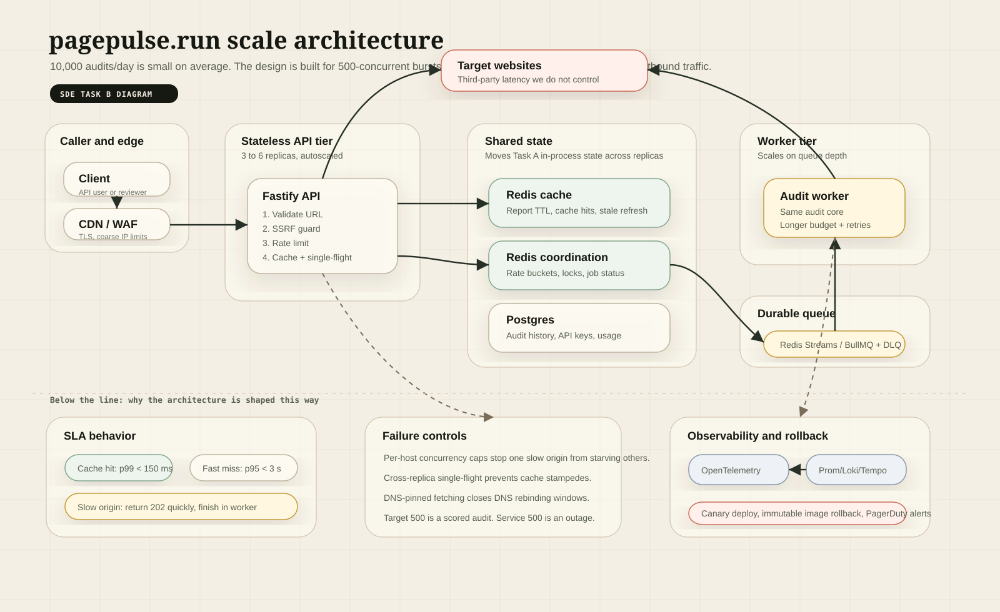

# Page Pulse at scale

Target: 10,000 audits per day, bursts of 500 concurrent requests, a customer-facing response-time SLA.

---

## 0. Read the numbers before designing anything

10,000 audits/day is **0.12 requests per second** on average. Even with all traffic squeezed into an 8-hour working window and a 3x peak-hour factor, it is under 1 rps. A single Node process handles that on a laptop.

So the load is not the problem. Three things are:

1. **Burst shape.** 500 concurrent against a 0.12 rps average is a burst-to-average ratio of roughly 4000:1. Everything here is sized for the burst, not the mean.
2. **Latency we don't own.** Our compute is around 15 ms: parse, run 24 checks, serialise. The other 200 to 8000 ms is somebody else's web server. We are promising an SLA on work performed by third parties who owe us nothing.
3. **Fan-out to strangers.** 500 concurrent audits can mean 500 outbound connections. Uncontrolled, we look like a DDoS source and get our egress IPs blocked.

Point 2 drives the single most important decision in this document, so it goes first.

### The SLA is only honest if the API has two modes

You cannot promise a response time for an operation whose duration is set by an origin you don't control. A slow WordPress site on shared hosting will take 9 seconds and there is nothing to engineer around it. So the SLA is written against what we actually control:

| Path | Promise | Basis |
| --- | --- | --- |
| Cache hit | **p99 < 150 ms** | Pure memory or Redis read. Fully ours. |
| Cache miss, sync | **p95 < 3 s**, hard deadline 5 s | Ours plus one origin fetch, with a deadline we enforce |
| Slow origin | **202 in < 100 ms**, result within 60 s | We stop waiting and hand back a job ID |
| Async submit | **p99 < 100 ms** for the 202 | Enqueue only |

A miss that blows the 5-second deadline does not become a 504. The request converts: the in-flight work moves to the queue and the client gets `202 Accepted` with a `jobId`, a poll URL, and an optional webhook. **We never miss the SLA because a customer's website is slow, and we never lie about how long it took.**

That is the thesis. Everything below serves it.

---

## 1. Architecture

### Architecture diagram

The diagram is shown directly below. The same diagram is also saved separately as [ARCHITECTURE_DIAGRAM.svg](./ARCHITECTURE_DIAGRAM.svg) for full-size viewing.



### Components

**CDN / edge.** TLS termination, WAF, coarse per-IP limits, and DDoS absorption. It also caches `GET /v1/audit?url=...` responses, since we already emit a correct `Cache-Control`. For a public audit tool where popular URLs get audited repeatedly, this is the cheapest possible hit: served without our infrastructure waking up.

**Load balancer.** Health-checks `/readyz`, not `/healthz`. The distinction matters: a saturated instance is alive but must stop receiving traffic. `/readyz` already returns 503 on queue saturation.

**API tier.** Stateless, so it scales horizontally and any replica can serve any request. Holds the full request path: validation, SSRF guard, rate limit, cache read, single-flight, bounded-concurrency fetch, analysis, scoring. Enforces the 5-second deadline and performs the conversion to async when it trips.

**Worker tier.** Runs the *same* audit core as the API, imported from the same module, under a longer time budget with retries. This is deliberate: two implementations of the audit path would drift, and a report produced synchronously must be byte-identical to one produced from the queue. Scales on queue depth, not CPU.

**Redis.** Shared report cache, rate-limit counters, single-flight locks, and job status.

**Postgres.** Durable history, API keys, usage records for billing. Not on the hot path: a Postgres outage degrades history writes, it does not stop audits.

**Egress NAT pool.** All outbound audit traffic exits through a pool of static IPs with a fixed reverse-DNS record and an identifying User-Agent. Target sites can identify and allowlist us, and a single blocked IP does not take out the whole service.

### Data flow, cache miss with a slow origin

```
Client → CDN (miss) → LB → API replica
  1. Validate URL, normalise                                    ~0.1 ms
  2. SSRF guard: resolve DNS, reject private ranges             ~5 ms (cached resolver)
  3. Token bucket in Redis (atomic Lua)                         ~1 ms
  4. GET report cache                                            ~1 ms  → miss
  5. SET NX single-flight lock                                   ~1 ms  → acquired
  6. Acquire local concurrency permit                            ~0 ms
  7. Fetch target                                              ... 5000 ms, deadline hit
  8. Publish job to the queue, release lock, return 202          ~3 ms
                                                          total ~5010 ms → 202 + jobId

Worker picks up the job
  9. Fetch with a 30 s budget, 2 retries with jitter
 10. Analyse + score (pure, ~12 ms)
 11. Write report to cache with TTL, mark job complete
 12. Fire the webhook, persist to Postgres
```

If a *second* client requests the same URL between steps 5 and 11, it finds the single-flight lock held, subscribes to the same job, and gets the report the moment it lands. One origin fetch serves the whole burst.

### Queueing strategy

**What is queued:** only work that exceeded the synchronous deadline, plus explicitly async submissions (scheduled audits, bulk jobs). The common case, a cache hit or a fast origin, never touches the queue. A queue on the hot path would add latency to the requests that were already going to be fast.

**Where queueing happens, in order:**

1. **Edge.** Excess connections are held or shed at the CDN before reaching us.
2. **In-process semaphore.** Bounds outbound fetches per replica. The queue is depth-bounded and wait-bounded, so a burst fails fast rather than accumulating. This is admission control, not buffering.
3. **Redis Streams via BullMQ.** The real durable queue: consumer groups, per-message acknowledgement, visibility timeout, retry with exponential backoff and jitter, and a dead letter stream after 3 attempts.

**Priorities:** three lanes, so a bulk job cannot starve interactive traffic.

| Lane | Source | Concurrency share |
| --- | --- | --- |
| `interactive` | Deadline conversions from a waiting client | 60% |
| `scheduled` | Recurring monitoring audits | 30% |
| `bulk` | Batch submissions | 10% |

**Backpressure:** when queue depth exceeds 5,000 or the oldest message is older than 5 minutes, the API starts returning 503 with `Retry-After` on bulk submissions first, then scheduled, and only sheds interactive traffic as a last resort. Shedding at the door beats timing out after doing the work.

**Idempotency:** the job key is the cache key plus a time bucket. A duplicate submission for the same URL inside the same bucket returns the existing `jobId` rather than creating a second job. Retries are therefore safe.

### Where state lives

| State | Home | Durability | Why there |
| --- | --- | --- | --- |
| Audit reports (cache) | Redis, TTL 300 s | Disposable | Shared across replicas; losing it costs a refetch, nothing more |
| Rate-limit buckets | Redis, atomic Lua | Disposable | Must be shared, or N replicas means N times the intended limit |
| Single-flight locks | Redis `SET NX PX` | Disposable | Cross-replica dedupe of the burst |
| Job state and results | Redis + Streams | Semi-durable, AOF every second | Losing one in-flight job is a retry, not a data loss incident |
| Audit history | Postgres | Durable | Trend charts, customer exports |
| API keys, plans, usage | Postgres | Durable, backed up | Billing correctness |
| In-flight permits, sockets | Process memory | None | Per-instance concern by definition |
| Config | Environment | n/a | Validated at boot, fails startup on a bad value |

**The API tier holds no state that survives a restart.** That is what makes rolling deploys, autoscaling and spot instances safe.

### Capacity sizing for the 500-concurrent burst

Assume a 65% cache hit ratio for a burst against a popular URL set. 500 concurrent becomes roughly 175 origin fetches. At a p50 of 400 ms and a p95 of 2.5 s per fetch, and with 4 API replicas at 60 outbound permits each (240 total, comfortable for IO-bound work in Node), Little's Law gives a drain time of about 1.8 s for p50 work and about 3 s at p95. That sits inside the 5-second deadline, so the burst is served synchronously and the queue stays empty.

Memory is the real ceiling, not CPU: 3 MB body cap × 60 concurrent fetches ≈ 180 MB of buffers per replica at absolute worst case, plus heap. 1 GB per replica, alarm at 700 MB.

**Autoscaling:** API on p95 latency and CPU, min 3 (so one instance can die without halving capacity), max 12. Workers on queue depth, min 2, max 10, scaling out aggressively and in slowly. Scale-out must be fast enough to matter: pre-warmed replicas, since a 45-second cold start is useless against a 5-second burst.

---

## 2. Technology decision record

Each entry names what was chosen, the alternative rejected, and the specific reason. The reason is what matters; the choice on its own is just a preference.

### Runtime: Node 22 + TypeScript
**Rejected: Go.** Go is genuinely better for this shape of work: real threads, lower memory per connection, no event-loop blocking risk. It loses on the thing that actually determines project outcome, which is that the parsing and check-authoring layer is where nearly all future change happens, and the JS ecosystem for HTML parsing and page auditing is far deeper. The workload is IO-bound anyway, so Go's concurrency advantage is worth less here than it looks. **Reconsider if** we add headless-browser rendering, where per-audit CPU stops being negligible.

### Framework: Fastify
**Rejected: Express.** Express's default error handling swallows async rejections, has no first-class request-ID plumbing, and no built-in structured logger. We would rebuild all three. Fastify ships schema-based serialisation, Pino integration, and a lifecycle with proper hook ordering. **Also rejected: raw `node:http`**, which is fine until you need routing, body limits, and content negotiation, and then you have written a worse Fastify.

### HTTP client: undici
**Rejected: axios.** Axios is built on the legacy `http` module, has weaker connection pooling, and its timeout is a single number covering the whole request. We need *layered* timeouts: connect, headers, and total. undici separates them, which is exactly the control needed to catch a target that connects and then trickles bytes forever. **Also rejected: global `fetch`**, which is undici underneath but hides the dispatcher, so per-request pool tuning and the redirect interceptor are out of reach.

### Parsing: Cheerio (static HTML)
**Rejected: Playwright / headless Chrome.** Rendering would let us audit SPAs and measure real Core Web Vitals, which is a genuinely better product. It also costs roughly 300 MB and 2 to 5 seconds per audit instead of 15 ms, which turns a 500-burst into a fleet of browser instances and blows the response-time SLA outright. The honest position: static parsing covers markup, headers and TTFB, which is most of the value, at 1% of the cost. Rendering ships later as a separate, explicitly slower, explicitly async `render: true` tier on its own worker pool. **Also rejected: jsdom**, which is heavier than Cheerio and builds a full DOM we do not need.

### Cache and coordination: Redis
**Rejected: in-process memory only** (what the current single-node build uses). It is faster and simpler, but with N replicas the hit ratio drops by roughly a factor of N, and worse, rate limits become per-replica, so 6 replicas silently means 6x the advertised limit. Shared state is not optional the moment you scale past one box. **Also rejected: Memcached**, which caches but cannot do atomic token buckets, `SET NX` locks, or streams; we would need Redis alongside it anyway.

### Queue: BullMQ on Redis Streams
**Rejected: AWS SQS.** SQS is more durable and fully managed, but it is another vendor dependency, adds 20 to 50 ms per operation, and has no native priority lanes, so we would emulate them with multiple queues. At 10k/day the durability difference is not worth the added surface, and we already run Redis. **Also rejected: Kafka**, which is the right answer at 10 million events a day and enormous operational overhead at ten thousand. **Reconsider SQS if** queue durability ever becomes a compliance requirement.

### Database: Postgres
**Rejected: MongoDB.** Reports are JSON-shaped, which superficially favours Mongo, but the queries that matter are relational and aggregate: usage per customer per month, score trends per URL over time. Postgres does those well and stores the report in `jsonb` with GIN indexing anyway, so we get the document flexibility without giving up joins. **Also rejected: ClickHouse**, which would be excellent for the time-series side at 100x this volume.

### Deployment: containers on a managed platform (Render / Fly / ECS Fargate)
**Rejected: Kubernetes.** Everything here is achievable with EKS, and none of it justifies the operational cost at this scale for a small team. **Also rejected: Lambda**, tempting for a bursty low-average workload, but a 500-burst against a cold path incurs cold starts on the deadline path, per-instance connection pooling is impossible so the outbound socket pool is lost, and long-running workers are a poor Lambda fit. **Reconsider Kubernetes at** roughly 10 services or 5 engineers, whichever comes first.

### Validation: Zod
**Rejected: JSON Schema via Fastify's built-in validator.** It is faster at runtime, but the types and the schema live separately and drift. Zod infers the TypeScript type from the schema, so the config object and the request body cannot disagree with their validators. The performance difference is microseconds against an operation dominated by a network round trip. Fastify's schema validation is still used for response serialisation, where the speed does matter.

### Observability: OpenTelemetry → Prometheus / Loki / Tempo / Grafana
**Rejected: Datadog.** Better product, materially better correlation between traces and logs, and a bill that grows with cardinality in a way that punishes exactly the high-cardinality labels (target domain, customer ID) we most want. OTel keeps the instrumentation vendor-neutral, so moving to Datadog later is a collector config change rather than a re-instrumentation project.

---

## 3. The three most likely failure modes

Ranked by probability × blast radius. All three are specific to auditing third-party URLs; generic "the database is down" is real but less likely and better understood.

### Failure mode 1 — A slow origin exhausts the connection pool and takes down unrelated audits

**Probability: high.** This is the classic cascading-failure shape, and it will happen.

**Mechanism.** A customer schedules monitoring against a site that goes into a degraded state where it accepts TCP connections and then never responds. Our fetches sit open until the timeout. If 60 of a replica's 60 permits are held by that one dying host, every *other* audit queues behind it. `/readyz` flips, the LB removes the instance, its traffic lands on the remaining replicas, they fill with the same slow host, and the whole fleet falls over. One broken website has taken out the service.

**Mitigation, in layers:**
- **Per-host permit caps.** No single target hostname may hold more than 15% of a replica's permits. This is the single most important control: it structurally bounds the blast radius of any one bad target. **Shipped in the single-node build** through `src/lib/hostGuard.ts`.
- **Per-host circuit breaker.** 5 consecutive timeouts for a host opens the breaker for 60 s; subsequent requests fail immediately with `TARGET_UNREACHABLE` and a clear message rather than consuming a permit. Half-open probe on recovery. **Shipped locally** with the same Redis-backed shape planned for the multi-node version.
- **Aggressive header timeout.** 5 s to first byte. A host that has not started responding by then is not going to.
- **Bulkhead by lane.** Scheduled and bulk audits draw from a separate permit pool, so a bad scheduled job cannot consume the interactive budget.

**Detection:** alert on `outbound_fetch_duration p95 by target_host`, and on any breaker transitioning to open.

### Failure mode 2 — Cache stampede on expiry, amplified by the burst

**Probability: high**, because it is triggered by normal traffic rather than by anything going wrong.

**Mechanism.** A popular URL's entry expires. The next 500-concurrent burst all miss, all attempt the origin. Single-flight fixes this *within* a replica, but with 6 replicas we still send 6 simultaneous fetches. Worse is the correlated case: a deploy or a Redis restart empties the cache, and *every* popular URL misses at once. The origin fetch rate jumps from a handful per second to hundreds, our egress IPs get rate-limited or blocked by the targets, and now audits fail for everyone.

**Mitigation:**
- **Cross-replica single-flight.** `SET NX PX` in Redis, not just an in-process map. Losers subscribe to the result channel instead of fetching. Fetch count for a burst on one URL goes to exactly 1.
- **Probabilistic early expiry.** Refresh an entry before it expires with a probability that rises as it approaches TTL. Entries then refresh at staggered times under load rather than all at the same instant.
- **Stale-while-revalidate.** Serve the expired entry immediately, marked `stale: true` with its age, and refresh in the background. Latency stays flat and correctness cost is bounded and disclosed.
- **Never flush the cache on deploy.** The `v1` key namespace means a new report shape gets new keys; old entries age out on their own rather than being cleared.

**Detection:** alert when `cache_hit_ratio` drops below 40% over 5 minutes, and on `origin_fetch_rate` exceeding 3x its trailing hourly baseline.

### Failure mode 3 — SSRF via DNS rebinding, or an egress reputation collapse

**Probability: medium. Severity: the highest here.** The first is a security incident; the second is a total outage of the core function.

**Mechanism A, rebinding.** We resolve `attacker.com`, get a public IP, pass the guard. Between our DNS check and undici's own resolution for the connection, the record's short TTL expires and the second lookup returns `169.254.169.254`. We then fetch cloud instance metadata and return the credentials in an audit report. **Closed in the single-node build**: `assertPublicTarget` resolves and validates once, and `fetcher.ts` now dials that exact validated address via a custom undici `connect` function (`pinnedConnect`) instead of letting undici re-resolve DNS — the `host` field is left untouched so TLS SNI and the `Host` header still come from the original hostname, and cert validation is unaffected. Every redirect hop is re-validated through the same `assertPublicTarget` check before it's followed and pinned to its own resolved address, so a redirect mid-chain to `http://10.0.0.1/` is rejected exactly like a direct request to it (`test/fetcher.test.ts`).

**Mechanism B, reputation.** Our egress IPs get classified as a scanner by Cloudflare or a similar provider. Audits start returning 403 challenge pages en masse. Every report scores badly, and it looks like a scoring bug rather than a network reputation problem.

**Mitigation:**
- ~~Pin the resolved IP~~ — **shipped**. See above.
- ~~Re-validate on every redirect hop~~ — **shipped**. See above.
- **Blocklist metadata endpoints explicitly** and run egress in a subnet with no route to internal services. Defence in depth: even a guard bypass reaches nothing worth reaching.
- **Identify ourselves honestly.** Static egress IPs, matching reverse DNS, a descriptive User-Agent with a contact URL, a published IP range, and respect for `robots.txt` on scheduled crawls. Register with the major CDNs as a known good bot.
- **Detect the difference.** Track the rate of 403/429 responses *from targets*, broken down by egress IP. A spike on one IP is a reputation problem, not a scoring problem, and the alert should say so.

**Detection:** any `URL_NOT_ALLOWED` triggered *after* a redirect pages immediately, since it means someone is actively probing. Alert on `target_403_rate by egress_ip` above 10%.

---

## 4. Observability and rollback

### The four numbers on the wall

Everything else is for diagnosis. These four say whether the product is working:

1. **SLA compliance rate** — share of requests inside their tier's promise. This is the only true business metric here.
2. **Cache hit ratio** — the primary driver of both cost and latency.
3. **Queue depth and oldest message age** — the leading indicator of every capacity problem, moving before latency does.
4. **Audit success rate**, separating *our* failures (5xx from us) from *target* failures (a 500 from the audited site, which is a successful audit).

### Metrics

| Metric | Type | Labels | Used for |
| --- | --- | --- | --- |
| `http_request_duration_seconds` | histogram | route, status, cache_result | SLA compliance, latency alerts |
| `audit_total` | counter | outcome, error_code | Success rate, error breakdown |
| `cache_operations_total` | counter | result (hit/miss/stale/expired) | Hit ratio |
| `outbound_fetch_duration_seconds` | histogram | target_host (top N, rest bucketed) | Failure mode 1 |
| `circuit_breaker_state` | gauge | target_host | Failure mode 1 |
| `queue_depth` / `queue_oldest_age_seconds` | gauge | lane | Capacity, autoscaling |
| `concurrency_permits_in_use` | gauge | replica | Saturation |
| `rate_limit_rejections_total` | counter | client_key_hash | Abuse, or a limit set too low |
| `target_response_status_total` | counter | status_class, egress_ip | Failure mode 3B |
| `ssrf_rejections_total` | counter | reason, phase (initial/redirect) | Security |

Cardinality is controlled deliberately: `target_host` is limited to the top 100 by volume with everything else in an `other` bucket, and client keys are hashed. Unbounded label cardinality is how a metrics bill becomes an incident.

### Logs and traces

Structured JSON, one object per line, with the request ID on every line, already implemented. The trace ID is injected into every log line so a Grafana log entry links straight to its trace in Tempo. Sampling: 100% of errors and slow requests, 5% of successes, since a fast successful audit's trace is rarely interesting and always expensive.

Deliberately logged as named events, not free text: `audit_completed`, `audit_failed`, `cache_stampede_detected`, `circuit_breaker_opened`, `ssrf_blocked`, `deadline_converted_to_async`, `queue_backpressure_applied`.

### Alerts

Split by whether a human must act *now*. An alert nobody acts on trains people to ignore alerts.

**Page immediately (wake someone up):**

| Alert | Condition | Why it pages |
| --- | --- | --- |
| SLA breach | compliance < 95% for 5 min | This is the customer promise |
| Service unavailable | 5xx rate > 5% for 2 min | We are broken, not the targets |
| Queue runaway | oldest message > 5 min | Users are waiting; autoscaling has failed |
| Redis unreachable | 30 s | Cache, limits and jobs all degrade at once |
| SSRF post-redirect | any occurrence | Active probing |
| No traffic | audits = 0 for 10 min in business hours | Silent total failure, the one every dashboard misses |

**Ticket, next business day:** cache hit ratio < 40% for 30 min; any circuit breaker open > 15 min; target 403 rate > 10% on one egress IP; p95 memory > 700 MB; DLQ non-empty; certificate expiry within 14 days.

**Explicitly not alerted:** individual audit failures, 429s, 422 SSRF rejections on the initial URL. These are the system working correctly and belong on a dashboard, not a pager.

### Deploy and rollback

**Pipeline.** Push → CI (typecheck, tests with coverage on Node 20 and 22, build, Docker build, container smoke test) → immutable image tagged with the commit SHA → staging → automated smoke suite against staging → production.

**Production rollout is canary, not blue-green.** Blue-green flips 100% of traffic at once, which means a bad deploy affects every request before anyone notices. Canary limits the blast radius by construction:

| Stage | Traffic | Hold | Auto-abort if |
| --- | --- | --- | --- |
| 1 | 5% | 10 min | error rate > 2x baseline, or p95 > 1.5x baseline |
| 2 | 25% | 15 min | same |
| 3 | 50% | 15 min | same |
| 4 | 100% | — | monitor 1 h |

Comparison is canary-versus-baseline over the same window, not against a fixed threshold. That way a traffic spike affecting both versions does not trigger a false abort.

**Rollback.** Images are immutable and tagged by SHA, so rollback is redeploying the previous tag: one command, roughly 90 seconds, no rebuild.

```bash
./scripts/rollback.sh                 # previous known-good SHA
./scripts/rollback.sh <sha>           # a specific one
```

The single hardest rollback constraint: **the previous version must always be able to run against the current state.** That means:

- **Database migrations are expand/contract.** Deploy the schema change first (additive only: new nullable columns, new tables), then the code that uses it, and only drop the old column a release later once rollback is no longer plausible. A migration that drops a column makes rollback impossible, which means the deploy is one-way, which means it is not really a deploy, it is a bet.
- **Cache entries are versioned.** A report-shape change bumps the key namespace to `v2`. The old version rolling back still finds its own `v1` entries; the two shapes never collide.
- **Queue messages carry a schema version.** Workers handle N and N-1, so an in-flight job written by the new version does not poison a rolled-back worker.
- **Feature flags for behavioural change.** Anything that changes scoring output ships behind a flag and is enabled separately from the deploy. Killing a bad feature is then a flag flip in seconds, no rollback at all. This matters especially for scoring: a change that shifts everyone's score is alarming to customers even when it is correct, so it goes out flagged and announced.

**Rollback triggers, decided in advance so nobody debates them at 3am:** 5xx rate above 5% for 2 minutes, p95 latency above 2x baseline for 5 minutes, SLA compliance below 90%, any data-corruption signal, or any error the on-call cannot explain within 10 minutes. The last one is the important one. Diagnosing on a rolled-back system is calm; diagnosing on a live broken one is not.

**Post-rollback:** the incident channel gets the SHA, the canary metrics that triggered it, and the artifact link automatically. The failing image is retained, not deleted, so the failure is reproducible in staging.

---

## 5. What is shipped now versus what changes at scale

Task A is intentionally a single deployable service, because the assignment asks for something live and runnable. Task B keeps the same behavior but moves shared state and long-running work to infrastructure that survives multiple replicas.

| Concern | Shipped in Task A | Scale version in Task B | Why it changes |
| --- | --- | --- | --- |
| Report cache | In-process TTL + LRU cache | Redis TTL cache, optionally edge-cached for GET requests | Multiple replicas need one shared cache, not N smaller caches. |
| Repeat cold requests | In-process single-flight map | Redis `SET NX PX` lock plus pub/sub or job subscription | A 500-request burst should trigger one origin fetch across the fleet, not one per replica. |
| Rate limiting | In-process token bucket per client | Redis Lua token bucket | Per-client limits must not multiply by the number of API replicas. |
| Global concurrency | Per-process bounded semaphore | Per-replica semaphore plus autoscaling and LB `/readyz` checks | Outbound sockets are still local resources, but saturation must remove the instance from rotation. |
| Per-host protection | In-process host bulkhead and circuit breaker | Redis-backed host state plus local per-replica permits | One failing target host should not consume the entire fleet. |
| Slow origins | Synchronous timeout with structured error | Convert to async job after a sync deadline | The SLA should not depend on a third-party website's latency. |
| Queueing | Bounded in-process wait queue for admission control | Redis Streams / BullMQ with priority lanes and DLQ | Durable work needs acknowledgements, retry and backpressure across workers. |
| Audit history | Not persisted | Postgres audit history and usage records | The live task does not need accounts or history, but customers will. |
| Observability | Structured JSON logs with request IDs | OpenTelemetry metrics, logs and traces | Local logs prove behavior; production needs fleet-level SLOs and alerts. |
| Rollback | GitHub Actions + Render deploy history | Immutable image tags, canary rollout, previous-SHA rollback | A customer-facing SLA needs a defined blast-radius and rollback process. |

This table is the boundary between implementation and architecture: the core audit pipeline stays the same, while the state holders and admission-control points become shared and observable.

---

Built for [Digital Heroes Training Task](https://digitalheroesco.com).
